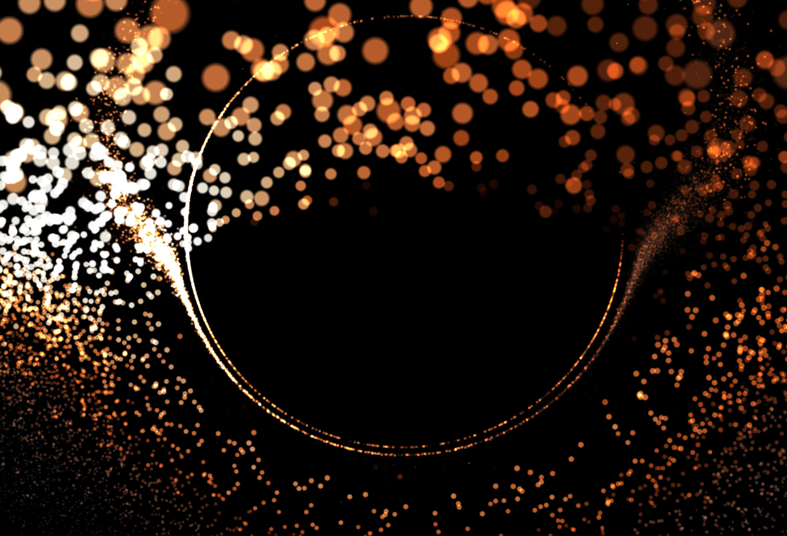
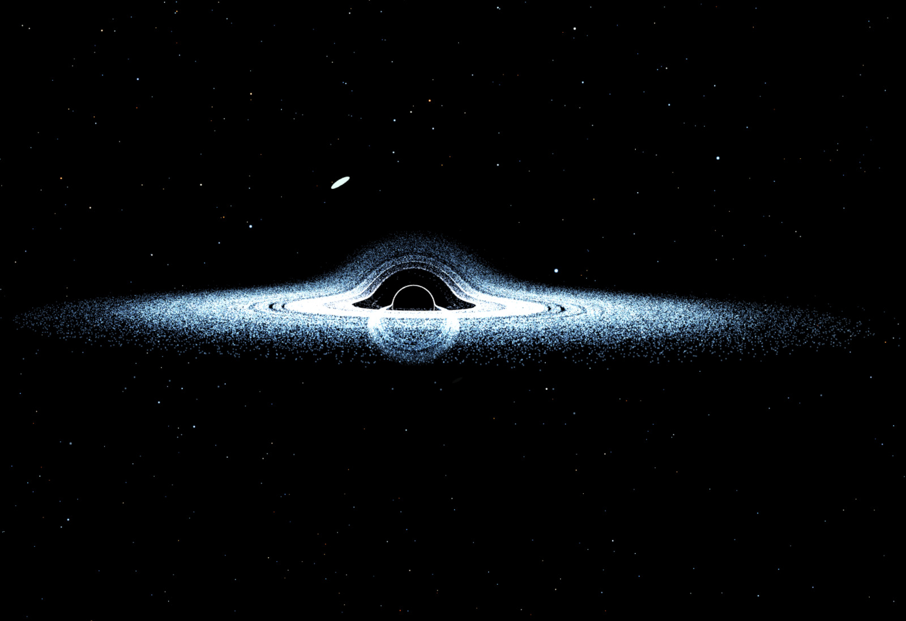
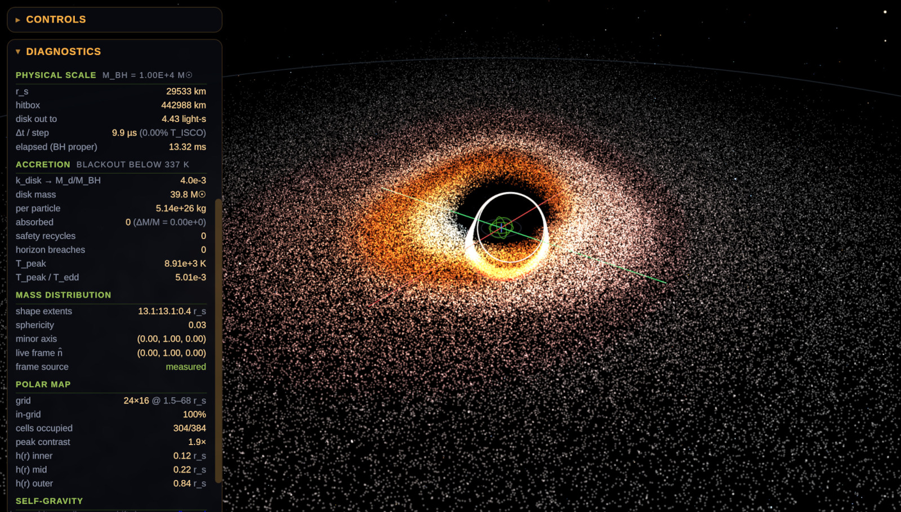

Black hole simulation in javascript (three.js, WebGL)

This project is particle-based, all features are "emergent" (with suitable cheats and simplifications).
Accretion disk: Newton-to-Schwarzschild-to-Kerr potential approximated (two-body),
accretion disk self-interaction (self-gravity, viscosity) modeled heuristically to avoid O(n^2) cost.
Disk initialization models some amount of ring-structure (that will be lost with the simulated dynamics), with option to generate a spherically symmetrical cloud, then let it flatten into a disk with the self-interaction heuristics.

Lensing: direct image (k=0) with thin-lense approximation, Kerr metric correction using Born approximation (closest approach); 
higher order images drawn by shader up to specified order (we are using k=2 by default, but subtle effects could be visible up to k=5 or so).

"Starfield" approximates distribution of naked-eye stars as seen from earth, with some primitive heuristics that add a "galactic plane" bias if the black hole is supermassive.

The "lone star" feature draws a single star on a Kepler orbit around the BH (at safe distance) to showcase lensing effect on extended body.
Not a well-developed feature, may be worth extending into a full "star disintegrates into particle cloud under tidal forces" simulation, but that's for another day.

**Related projects (use raytracing):** 
- https://github.com/rossning92/Blackhole
- https://github.com/Silvera0218/BlackHole-Simulation

